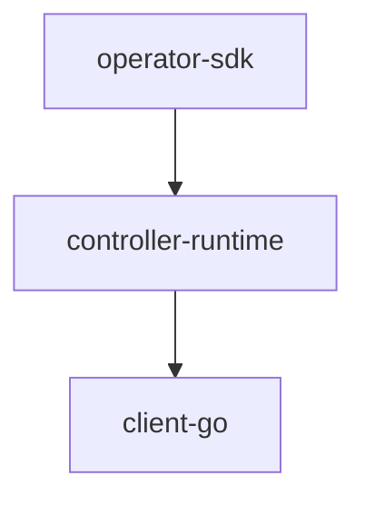

# controller-runtime 和 operator-sdk 的关系

## 层级关系

## 详细说明

### controller-runtime
- 是一个基础库，提供了构建 Kubernetes controller 的核心功能
- 由 Kubernetes SIG (Special Interest Group) 维护
- 提供了以下核心功能：
  - Controller 的基础框架
  - Client 接口用于与 Kubernetes API 交互
  - Cache 和 Informer 机制
  - Reconciler 模式的实现
  - Webhook 服务器
### operator-sdk
- 是基于 controller-runtime 的更高层框架
- 提供了更多便利性功能：
  - 项目脚手架
  - 代码生成工具
  - 测试框架
  - 打包和部署工具
- 简化了 Operator 的开发流程

## 使用场景

- 如果你想直接开发 Controller，可以使用 controller-runtime
- 如果你想开发完整的 Operator，建议使用 operator-sdk，因为它提供了更完整的工具链

## 关系总结

可以把 controller-runtime 理解为"发动机"，而 operator-sdk 则是一个完整的"汽车"。operator-sdk 在 controller-runtime 的基础上提供了更完整的开发体验。

