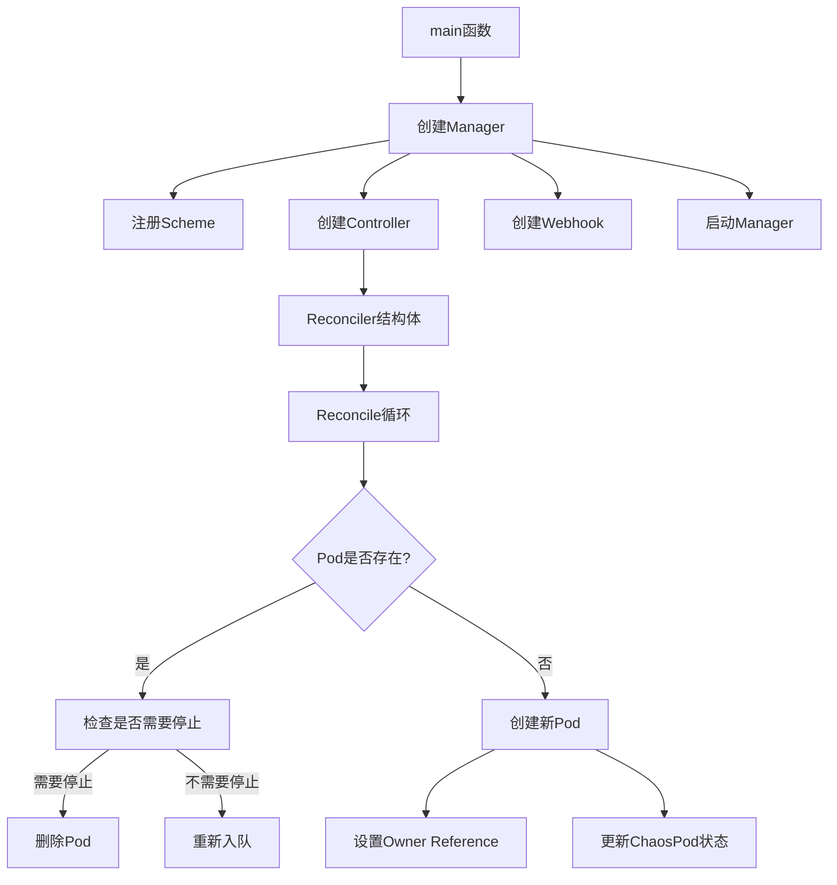

# Controller-Runtime CRD Example

这个示例展示了如何使用controller-runtime构建一个基本的Kubernetes控制器。

## 架构概览



## 核心概念

### 1. Manager模式
Manager是控制器的核心组件，负责：
- 管理共享的客户端缓存
- 管理运行的控制器
- 管理webhook服务器

### 2. 控制器模式

```go
ctrl.NewControllerManagedBy(mgr).
For(&api.ChaosPod{}). // 监听ChaosPod资源
Owns(&corev1.Pod{}). // 监听所属的Pod资源
Complete(&reconciler{...})
```

### 3. Reconcile循环
实现了控制器的核心业务逻辑：
- 获取ChaosPod资源
- 检查关联的Pod
- 根据状态决定是创建还是删除Pod
- 更新ChaosPod状态

### 4. Webhook支持

```go
ctrl.NewWebhookManagedBy(mgr).
For(&api.ChaosPod{}).
Complete()
```

## 示例功能

这个混沌测试控制器示例实现了以下功能：
- 随机创建和删除Pod进行混沌测试
- 通过Owner Reference管理Pod的生命周期
- 使用webhook进行准入控制
- 展示了controller-runtime的基本模式和最佳实践

## 学习要点

1. 理解控制器模式和reconcile循环
2. 掌握资源的Owner Reference关系
3. 了解webhook的实现方式
4. 学习controller-runtime的基本API使用

## 运行示例

1. 安装CRD：

```bash
bash
make install
```
2. 运行控制器：
```bash
make run
```
3. 创建ChaosPod实例：
```bash
kubectl apply -f config/samples/
```

这个README.md文件提供了：
1. 清晰的架构图示
2. 核心概念的解释
3. 示例功能说明
4. 关键学习点
5. 运行说明

这样的文档结构可以帮助其他开发者快速理解和使用这个示例。
